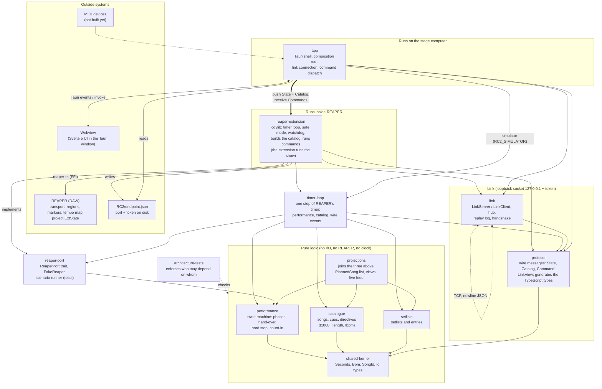

# Architecture map

Which crate is responsible for what, and which systems it is connected to. Arrows point from the crate that uses to the crate (or system) that is used. The rules behind it are enforced by `crates/architecture-tests`. Source of truth for the design is `docs/SPEC.md`; this page is the picture of what exists today.

Simplified data flow while playing:

1. REAPER plays. The extension's timer loop (about 30 Hz) reads the position, steps `performance`, and carries out the effects on REAPER through the `ReaperPort`.
2. When the state or the project content changes, the extension pushes `State` and `Catalog` over the link.
3. The app keeps a `LinkView`, emits it to the UI, and the UI draws it. The UI never works out state itself.
4. A button, key or (later) MIDI note becomes a `Command`, goes through `dispatch`, over the link, into a queue that the timer loop drains on its next tick. A connection thread never touches REAPER.

| Crate | Responsible for | Talks to |
|---|---|---|
| `shared-kernel` | value types (`Seconds`, `Bpm`, ids) | nothing |
| `catalogue` | songs, cues, marker directives | `shared-kernel` |
| `setlists` | setlist and entry rules | `shared-kernel` |
| `performance` | the one implementation of the performance rules | `shared-kernel` |
| `projections` | turning songs and a setlist into the planned list and views | `performance`, `catalogue`, `setlists` |
| `reaper-port` | the interface to REAPER and a fake for tests | `performance` |
| `protocol` | what goes over the link, and the generated TypeScript types | `shared-kernel` |
| `link` | the socket: server, client, replay | `protocol` |
| `timer-loop` | one step of REAPER's timer and what is pushed to the link, over any `ReaperPort` (ADR-012) | `performance`, `catalogue`, `setlists`, `protocol`, `link`, `reaper-port` |
| `reaper-extension` | everything that lives inside REAPER | REAPER, `timer-loop`, `link`, `protocol` |
| `app` | the stage app shell, and the simulator (the timer loop over `FakeReaper`) | `link`, `protocol`, `timer-loop`, `reaper-port`, the webview, `endpoint.json` |
| `architecture-tests` | the dependency rules | the manifests |
